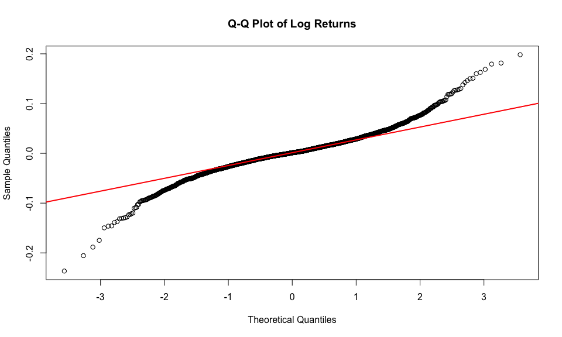
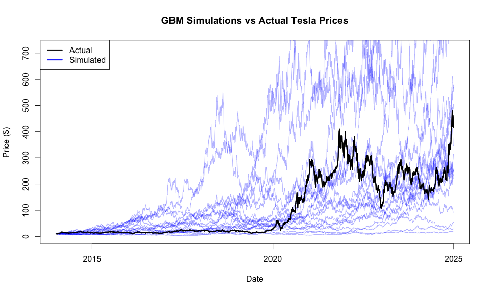
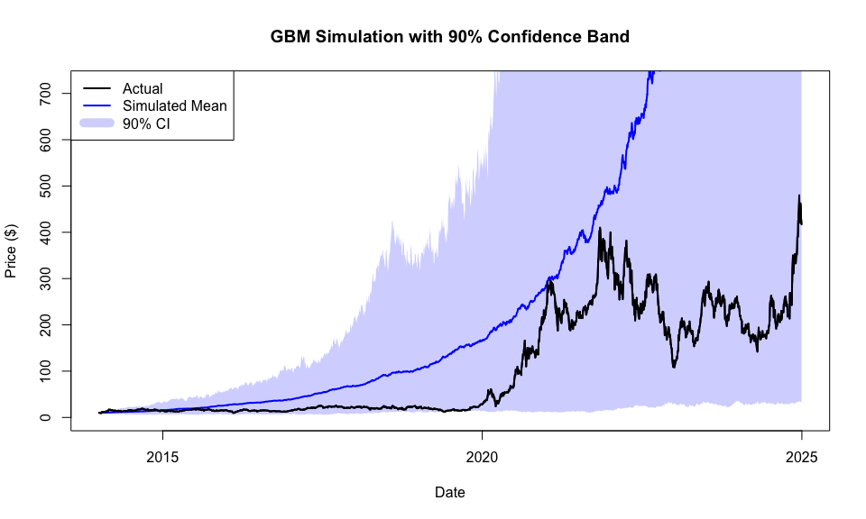
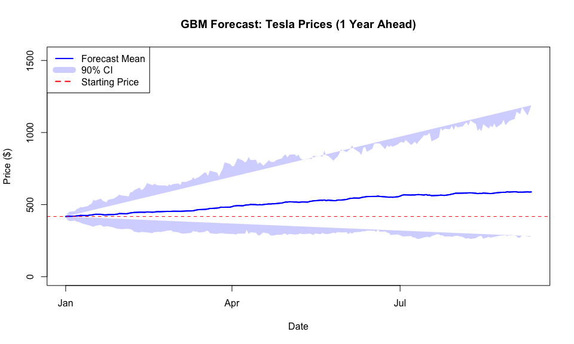

# Stock Price Modelling with Geometric Brownian Motion

A quantitative finance project applying Geometric Brownian Motion (GBM) to Tesla (TSLA) stock prices: parameter estimation, statistical validation of model assumptions, and Monte Carlo simulation for price forecasting.

## Project Overview

This project models Tesla's share price using GBM, the stochastic process underlying the Black-Scholes framework. Starting from ten years of daily price data, I estimate the drift and volatility parameters two independent ways, test whether the model's core assumption (normally distributed log returns) actually holds, and use the fitted model to simulate thousands of possible future price paths.

The point of the project is not just to run a simulation, it is to check whether the model's assumptions survive contact with real data, and to be explicit about where they break down.

## Key Findings

### Parameter Estimation

Using 2,766 trading days of TSLA closing prices (2014-01-03 to 2024-12-30):

| Parameter | Estimate |
|---|---|
| Drift (μ), annualised | 49.80% |
| Volatility (σ), annualised | 56.23% |
| Mean daily log return | 0.001349 |
| Daily standard deviation | 0.035418 |

Parameters were estimated two ways, Method of Moments and Maximum Likelihood Estimation, and converged to the same values (μ = 0.4980 vs 0.4980, σ = 0.5623 vs 0.5622), which is a useful cross-check that the estimation is stable. 95% confidence intervals: μ ∈ [0.477, 0.519], σ ∈ [0.547, 0.577].

### Model Validation: the assumptions don't hold

GBM assumes log returns are normally distributed and independent. I tested this rather than assuming it:

| Test | Result |
|---|---|
| Shapiro-Wilk | W = 0.9458, p < 0.001 → normality **rejected** |
| Jarque-Bera | χ² = 2274.97, p < 0.001 → normality **rejected** |
| Kolmogorov-Smirnov | D = 0.997, p < 0.001 → normality **rejected** |
| Kurtosis | 7.44 (excess kurtosis 4.44) → **leptokurtic**, fat tails |
| Skewness | -0.036 → approximately symmetric |

All three normality tests reject the assumption at the 5% level, and the excess kurtosis confirms fat tails: extreme price moves happen more often than a normal distribution predicts. This is a well-documented limitation of GBM, and the project treats it as a finding rather than glossing over it.



### Monte Carlo Simulation

Using the fitted parameters, I simulated price paths both in-sample (against the 2014-2024 actual price series) and out-of-sample (a 1-year forward forecast from the last observed price of $417.41):

**In-sample fit:** Simulated paths (100 runs) broadly bracketed the actual price series in a 90% confidence band, though the model underestimated the extreme 2020-2021 rally, exactly what you'd expect given the fat tails identified above. Error metrics against the mean simulated path: MAE $240.56, RMSE $415.86.




**1-year forward forecast (5,000 paths):**

| Metric | Value |
|---|---|
| Starting price | $417.41 |
| Forecast mean | $695.54 |
| Forecast median | $594.62 |
| 90% CI | [$233.66, $1,304.49] |
| Implied expected return | 66.63% |

The width of that confidence interval, roughly $234 to $1,304 on a $417 starting price, is itself a finding: it shows how much uncertainty a single volatility parameter generates over a one-year horizon for a stock as volatile as Tesla, and why point forecasts from GBM should always be read alongside the interval, not instead of it.



## Methodology

- **Data**: TSLA daily closing prices, 2014-01-01 to 2024-12-31, via `quantmod`/`getSymbols`
- **Returns**: Log returns, `diff(log(price))`
- **Parameter estimation**: Method of Moments and Maximum Likelihood Estimation (`optim`, L-BFGS-B), cross-checked against each other
- **Validation**: Q-Q plots, Shapiro-Wilk, Jarque-Bera, Kolmogorov-Smirnov, skewness/kurtosis, ACF (independence check)
- **Simulation**: GBM path simulation via `dS = μS dt + σS dW`, discretised with a standard Euler scheme, 100 in-sample paths and 5,000 out-of-sample paths

## Technologies Used

- **R**: `quantmod`, `tidyverse`, `moments`, `tseries`, `knitr`

## Limitations and Further Work

GBM assumes constant volatility and normally distributed returns, both rejected by the tests above. Real stock prices exhibit volatility clustering, fat tails, and occasional jumps that GBM cannot capture, which is why the out-of-sample confidence interval is so wide. Natural extensions: stochastic volatility (Heston) or jump-diffusion (Merton) models, which relax exactly the assumptions this project shows don't hold.

## How to Run

```r
# Install required packages
install.packages(c("quantmod", "tidyverse", "moments", "reshape2", "tseries", "knitr"))

# Knit the R Markdown file
rmarkdown::render("stock-prices-gbm.Rmd")
```

## Author

**Amba Sharma** — BSc Mathematics (Applied Mathematics emphasis), University of Leicester.
